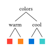

# typst-syntree

**syntree** is a typst package for rendering syntax trees / parse trees (the kind linguists use).

# Installation
Add `#import "@preview/syntree:0.2.1: syntree` somewhere in the preamble. This will add both the latest version of the package, and import the `syntree` function from the library.

# Usage
The name and syntax are inspired by Miles Shang's [syntree](https://github.com/mshang/syntree). Here's an example to get started:

<table>
<tr>
<td>

```typ
#import "@preview/syntree:0.2.1": syntree

#syntree(
  nonterminal: (style: "italic"),
  terminal: (fill: blue),
  child-spacing: 3em, // default: 1em
  layer-spacing: 2em, // default: 2.3em
)[
  [S [NP This] [VP [V is] [^NP a wug]]]
]
```

</td>
<td>


</td>
</tr>
</table>

There's full support for formulas inside nodes; for example, `#syntree[[DP$zws_i$ this]]` or `#syntree[[C $diameter$]]`.

For more flexible tree-drawing, use `tree`:

<table>
<tr>
<td>

```typ
#import "@preview/syntree:0.2.1": tree

#let bx(col) = box(fill: col, width: 1em, height: 1em)
#tree("colors",
  tree("warm", bx(red), bx(orange)),
  tree("cool", bx(blue), bx(teal)))
```

</td>
<td>



</td>
</tr>
</table>
